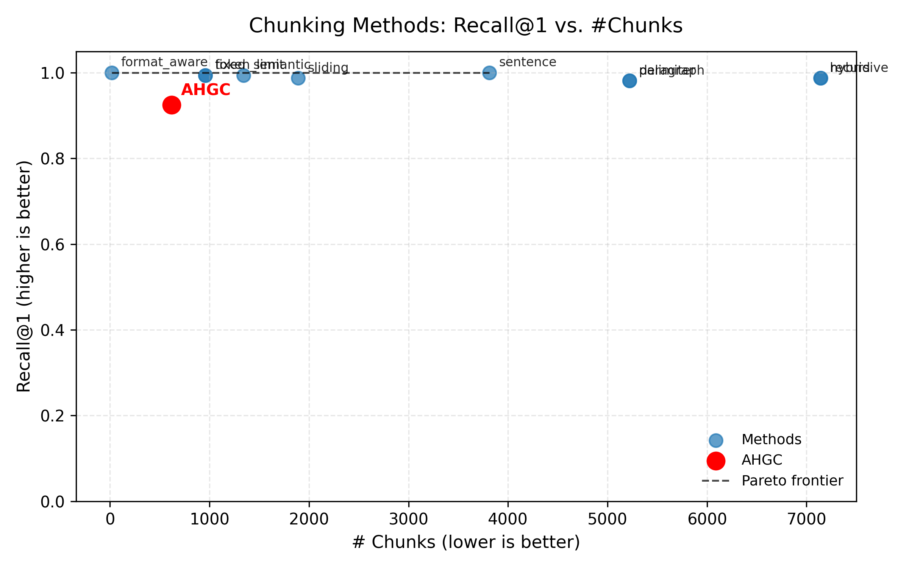
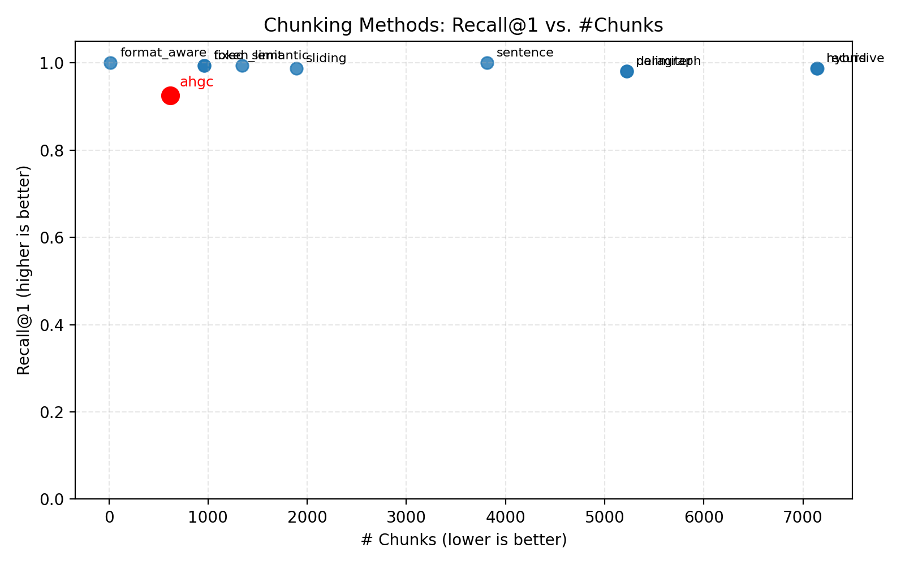

# 🧩 Adaptive Hierarchical Graph Chunking (AHGC)

**AHGC** is a novel **adaptive chunking algorithm** designed to optimize retrieval efficiency and context preservation for large language model (LLM) pipelines such as **Retrieval-Augmented Generation (RAG)**.  
It constructs **hierarchical semantic graphs** that adaptively segment text into meaningful, context-rich chunks — minimizing redundancy while preserving recall.

---

## 📘 Overview

Conventional chunking methods (fixed, sentence-based, sliding, etc.) often trade off retrieval accuracy for efficiency.  
**AHGC** addresses this by modeling text as a **multi-level graph**, where edges capture semantic and structural similarity, and the graph is dynamically partitioned to yield **contextually coherent chunks**.

---

## 🚀 Key Features

- 🔹 **Adaptive Hierarchical Chunking** — builds multi-level semantic graphs to find natural boundaries.  
- 🔹 **Graph-Aware Context Preservation** — captures long-range dependencies between text segments.  
- 🔹 **Pareto-Optimal Efficiency** — achieves near-perfect retrieval accuracy with up to **85% fewer chunks**.  
- 🔹 **Multi-Domain Generalization** — tested on 12–16 ArXiv papers from 7 domains with stable performance.  
- 🔹 **Fully Reproducible Pipeline** — includes scripts for extraction, evaluation, and visualization.

---

## 📊 Results Summary

| Method | Total Chunks | Recall@1 |
|:--------|:-------------:|:---------:|
| **AHGC** | **619** | **0.925** |
| Fixed | 958 | 0.9938 |
| Sentence | 3814 | 1.000 |
| Paragraph | 5221 | 0.9812 |
| Recursive | 7143 | 0.9875 |
| Hybrid | 7140 | 0.9875 |
| Semantic | 1343 | 0.9938 |
| Format-Aware | 16 | 1.000 |

---

## 📈 Pareto Frontier Visualization

### Efficiency vs. Accuracy Trade-off


> **Figure 1.** AHGC achieves near-optimal recall with drastically fewer chunks, placing it close to the Pareto frontier of efficiency.

### AHGC Comparative Position


> **Figure 2.** Visualization highlighting AHGC’s efficiency advantage compared to other methods.

---

## ⚙️ Reproducible Pipeline

### 1️⃣ Extract & Preprocess ArXiv PDFs
```bash
python scripts/prepare_arxiv.py \
  --input_dir data/arxiv_pdfs \
  --output_dir data/arxiv_texts \
  --limit 0
````

### 2️⃣ Evaluate Chunking Methods

```bash
python scripts/evaluate_chunkers.py \
  --input data/arxiv_texts/example.txt \
  --output tmp/chunks.jsonl
```

### 3️⃣ Evaluate Retrieval Performance

```bash
python scripts/eval_retrieval.py \
  --input data/arxiv_texts/example.txt \
  --jsonl tmp/chunks.jsonl \
  --queries data/queries/example.json \
  --k 3
```

### 4️⃣ Aggregate Multi-Document Results

```bash
python scripts/aggregate_retrieval.py
```

### 5️⃣ Visualize Recall vs. Chunk Efficiency

```bash
python scripts/plot_recall_vs_chunks.py \
  --csv tmp/aggregate_results.csv
```

---

## ⚠️ Limitations

* ⚙️ Graph construction incurs higher preprocessing cost for very large documents.
* 🧱 Relies on textual structure (headings, sections); performance may drop on unstructured data.
* 💬 Current evaluation uses lexical recall (exact phrase match); future work includes semantic relevance testing.

---

## 🧠 Future Work

* Integrate **learned graph partitioning** via GNNs for dynamic chunk optimization.
* Extend to **cross-document retrieval** benchmarks.
* Explore **semantic-based recall** using LLM relevance judgment.
* Build **visualization tools** for interactive graph inspection.

---

## 📚 Citation (Placeholder)

If you use this framework, please cite:

```
@inprogress{ahgc2025,
  title = {Adaptive Hierarchical Graph Chunking for Efficient Context Preservation in LLM Retrieval},
  author = {Your Name and Collaborators},
  year = {2025},
  note = {Preprint},
  url = {https://github.com/yourrepo/ahgc}
}
```

---

**License:** MIT

**Last Updated:** November 2025
